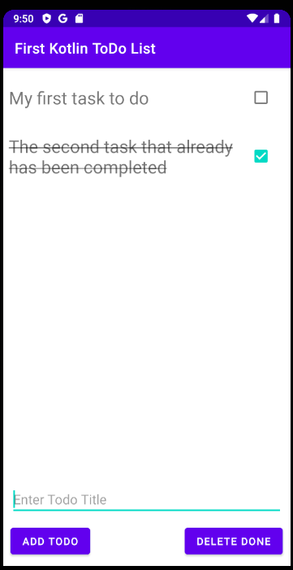

# Simple Kotlin ToDo list with Room database support

This is my first approach to creating Android applications using Kotlin. Based on the [tutorial](https://www.youtube.com/watch?v=BBWyXo-3JGQ), extended with ViewModels and Room database support.

